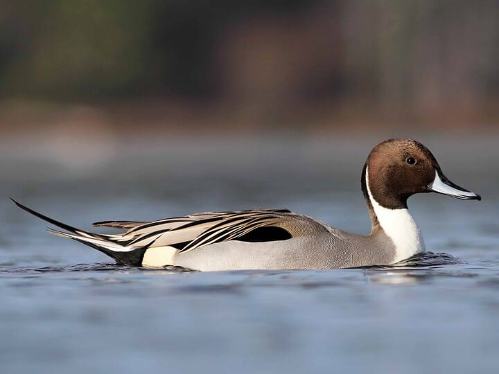
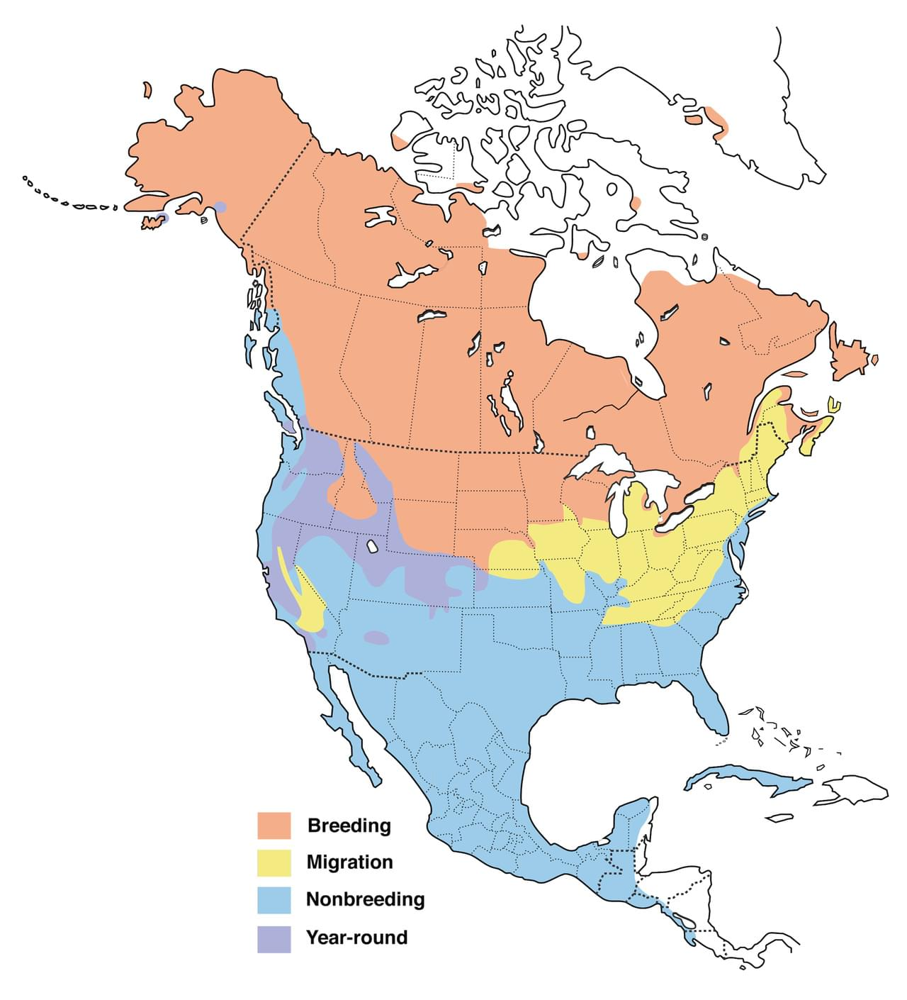

# Northern Pintail &nbsp; NOPI
**Anseriformes** 
**Anatidae** 
*Anas acuta*

## Basic Description
- Trim, elegant dabbler
- Open habitats, usually wary
- Male has *white stripe* running up long neck onto brown head; gray body, long tail
- Female mottled buff-brown; known by pointed tail, long neck, gray bill
- In flight, shows narrow white trailing edge on inner part of wing

<!--TAG helps me identify what the link points to-->
## Images

 
Male   

 
Female   

