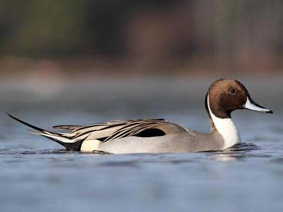
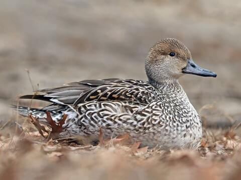

# Northern Pintail &nbsp; NOPI
**Anseriformes** 
**Anatidae** 
***Anas acuta***

## Basic Description
- Trim, elegant dabbler
- Likes very open habitats and usually wary
- Male has *white stripe* running up long neck onto brown head; gray body, long tail
- Female mottled buff-brown; known by pointed tail, long neck, gray bill
- In flight, shows narrow white trailing edge on inner part of wing.

## Images <!--TAG helps me identify what the link points to-->
 
Male   
 
Female   
 
