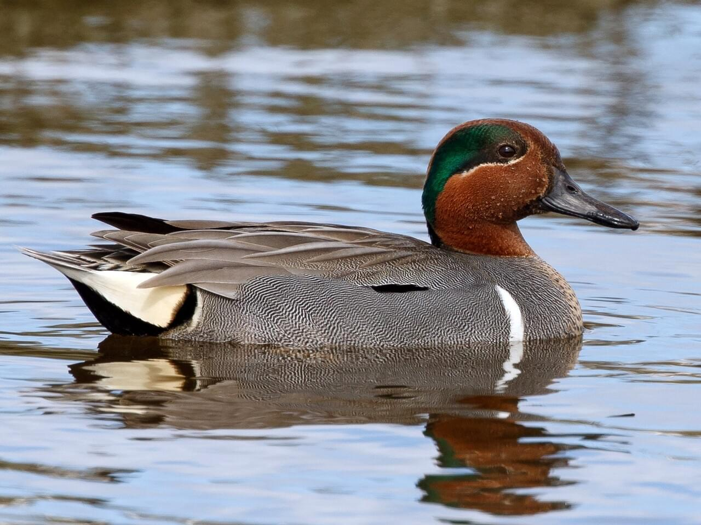
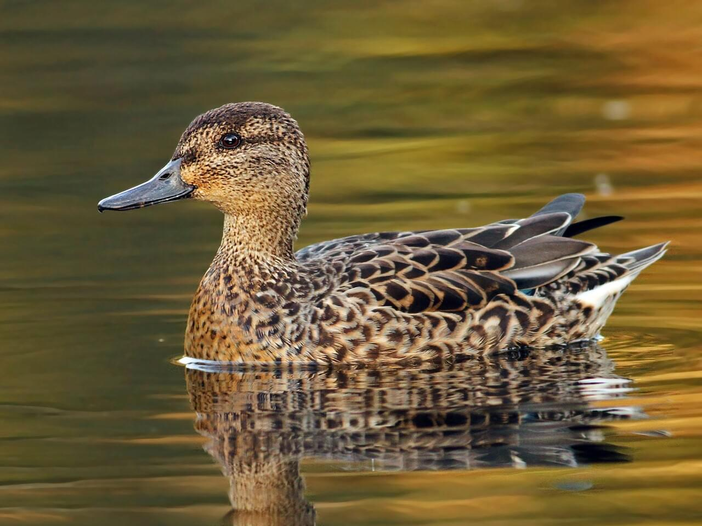

# Green-winged Teal &nbsp; GWTE
**Anseriformes** 
**Anatidae** 
***Anas crecca***

## Basic Description
- The little Green-winged Teal is the smallest dabbling duck in North America.
- The natty male has a cinnamon-colored head with a gleaming green crescent that extends from the eye to the back of the head.
- In flight, both sexes flash deep-green wing patches (specula).
- Look for them on shallow ponds and in flooded fields, and listen for the male’s decidedly non-ducklike whistle.
- These common ducks breed along northern rivers; wintering flocks can number as many as 50,000.

<!--TAG helps me identify what the link points to-->
## Images
 
Male   
 
Female   

