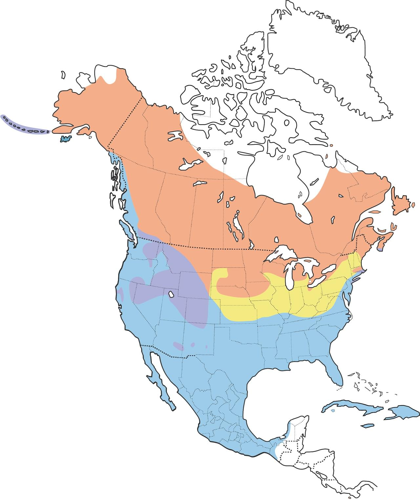

# Green-winged Teal &nbsp; GWTE
**Anseriformes** 
**Anatidae** 
 *Anas crecca*

## Basic Description
- Our smallest dabbler
- Flocks in flight look very fast, twisting and turning in the air
- Male has *chestnut* head with *green* ear patch, white bar on side of chest, yellow *tail-light*
- Female known by small size, strong eyeline, gray bill

## Images

<!---Enter name of .jpg file--->
 

<!---Enter caption--->
Male   

<!---Enter name of .jpg file--->
 

<!---Enter caption--->
Female   

<!---Enter name of range map--->
