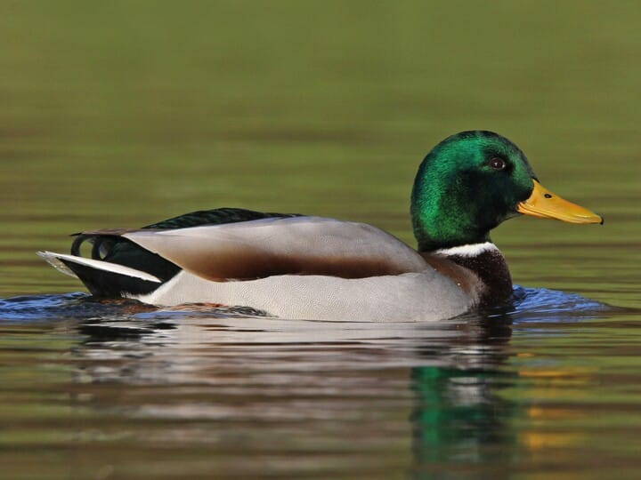
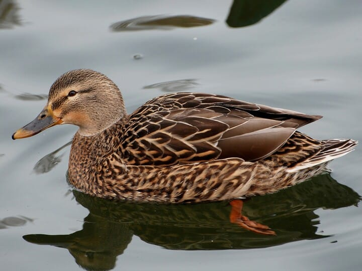
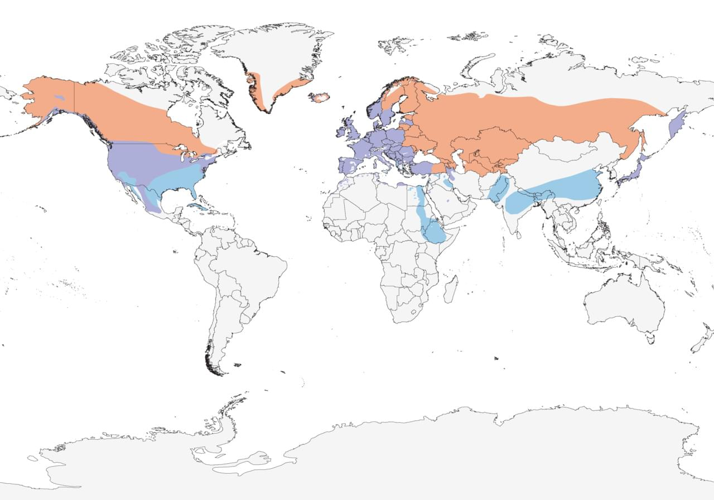

# Mallard &nbsp; MALL
**Anseriformes** 
**Anatidae** 
***Anas platyrhynchos***

## Basic Description
- Male's green head contrasts with yellow bill, white neck reng, reddish chest, gray body
- Female mottled brown, with *black* smudges on *orange* bill
- Both sexes show speculum on trailing edge of wing, *blue with white borders*

<!--TAG helps me identify what the link points to-->
## Images
 
Male   
 
Female   

