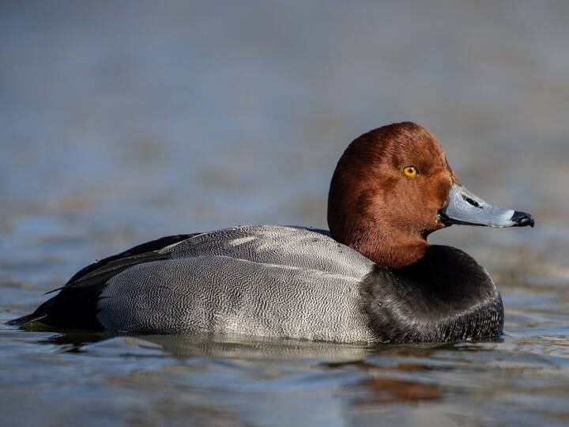
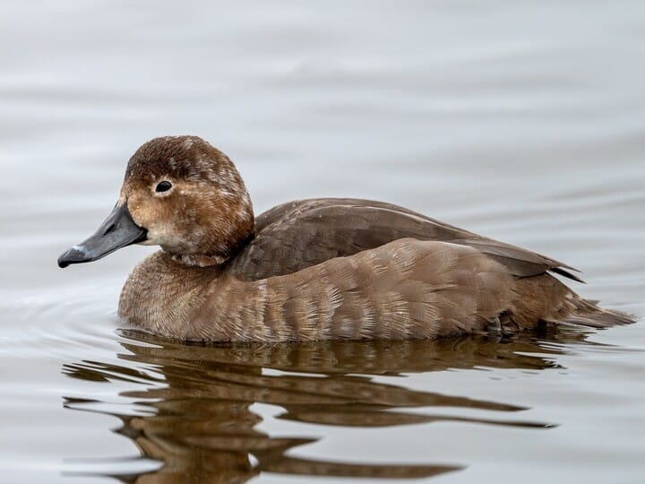
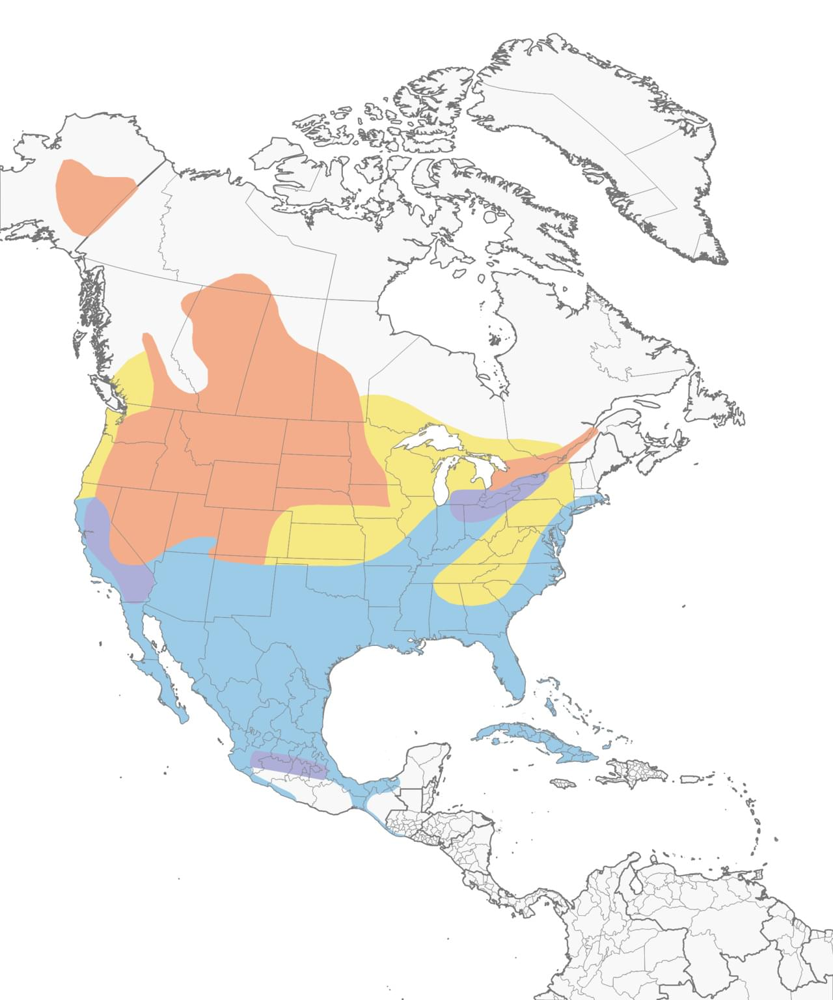

# Redhead &nbsp; REDH
**Anseriformes** 
**Anatidae** 
 *Aythya americana*

## Basic Description
- Although a diver, it dabbles too
- Both sexes told from Canvasback by *rounder* head, shorter bill with pale band near tip
- Male has *gray* (not white) back
- Female suggests female Ring-necked Duck, but browner, usually plainer on face, and lacks RNDU's high, peaked head shape

## Images

<!---Enter name of .jpg file--->
 

<!---Enter caption--->
Male   

<!---Enter name of .jpg file--->
 

<!---Enter caption--->
Female   

<!---Enter name of range map--->
