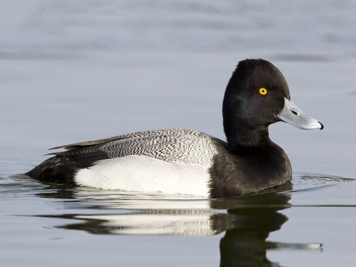
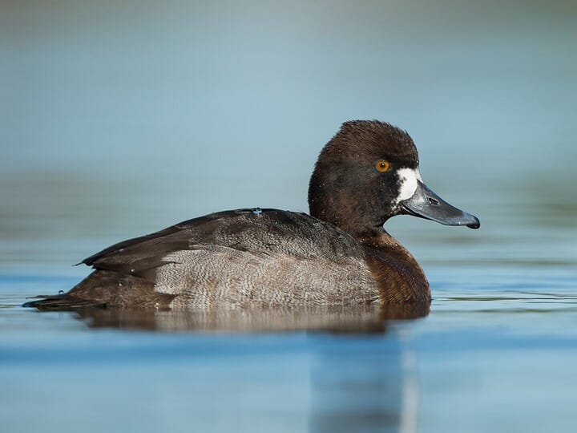
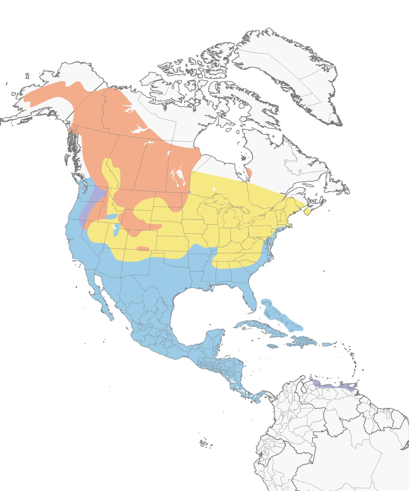

# Lesser Scaup &nbsp; LESC
**Anseriformes** 
**Anatidae** 
 *Aythya affinis*

## Basic Description
- Very similar to Greater--males with black head and whitish back, females with sharp white patch around base of bill
- Lesser is usually more common on *inland lakes* in winter
- Head shape is best mark: Lesser has *peak at back of crown*, slightly smaller bill than Greater
- In flight, note shorter white wing stripe on Lesser

## Images

<!---Enter name of .jpg file--->
 

<!---Enter caption--->
Male   

<!---Enter name of .jpg file--->
 

<!---Enter caption--->
Female   

<!---Enter name of range map--->

