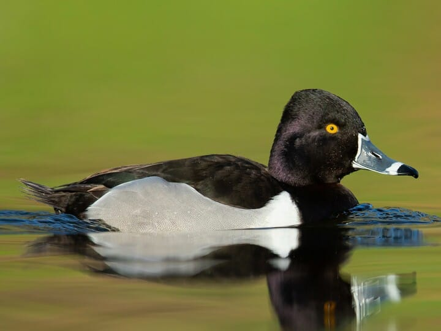
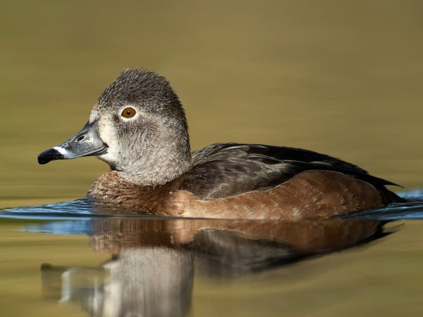
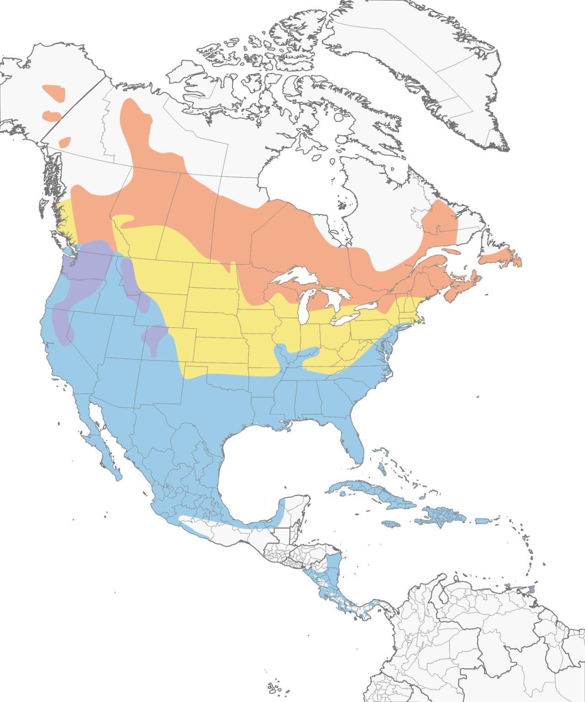

# Ring-necked Duck &nbsp; RNDU
**Anseriformes** 
**Anatidae** 
 *Aythya collaris*

## Basic Description
- Favors sheltered waters more than most divers
- Often in small flocks on small tree-lined ponds in winter
- Male has black head and back
- *White bar* separates *gray sides* from black chest, rings on *bill* are obvious
- Female mostly gray-brown; shows wide pale area near base of bill, usually less contrasty than on female scaup

## Images

<!---Enter name of .jpg file--->
 

<!---Enter caption--->
Breeding male   

<!---Enter name of .jpg file--->
 

<!---Enter caption--->
Female   

<!---Enter name of range map--->
