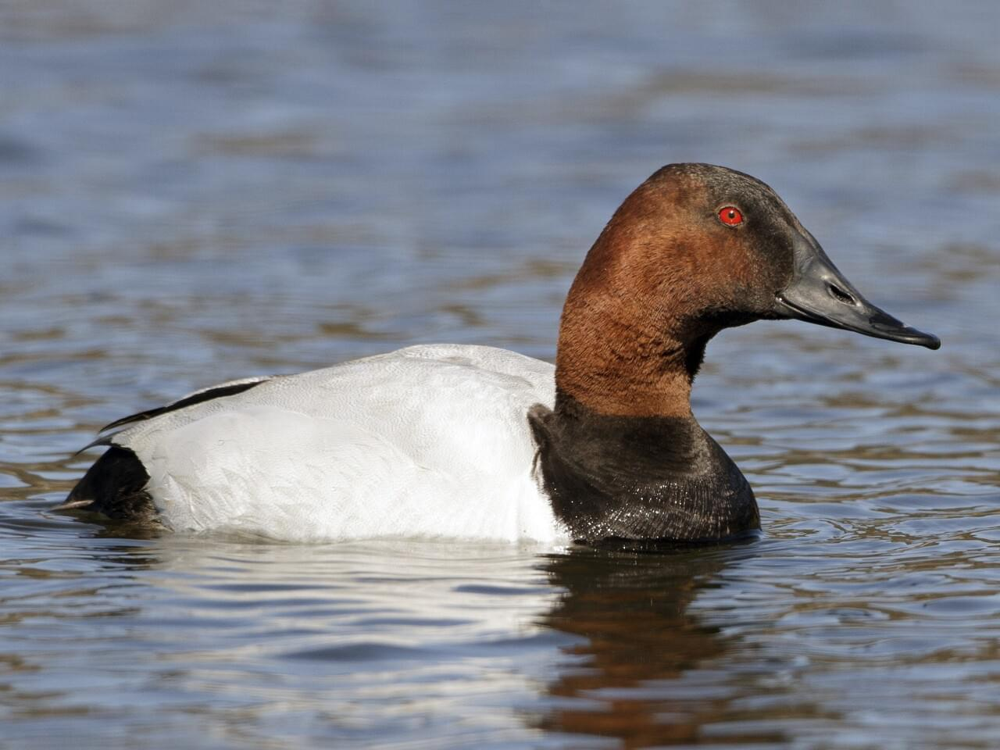
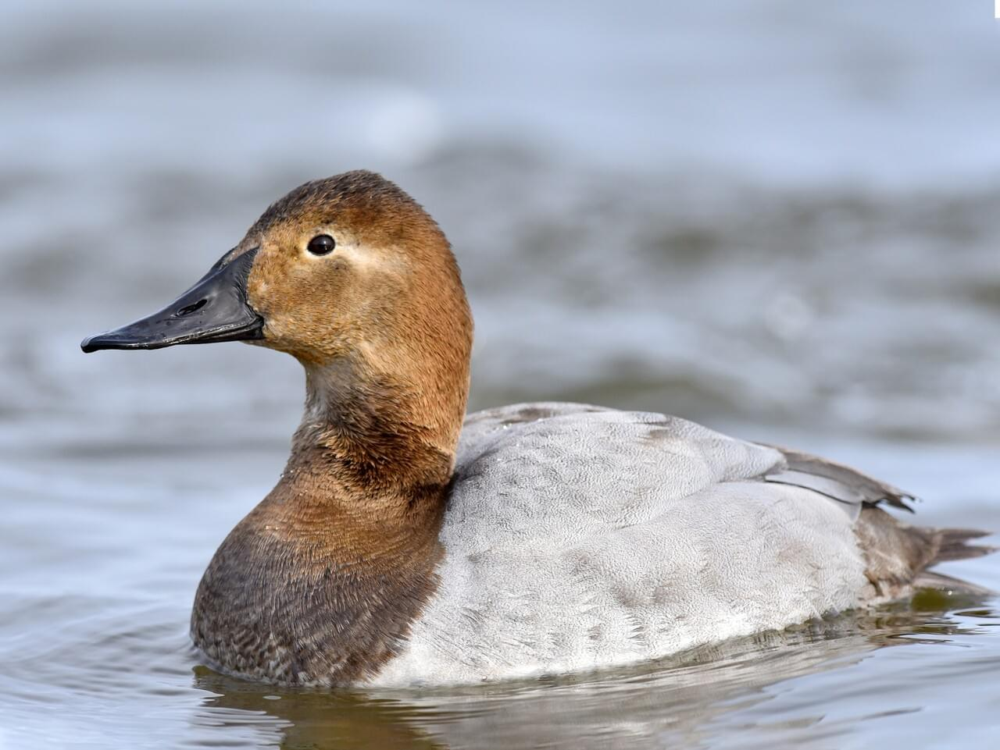
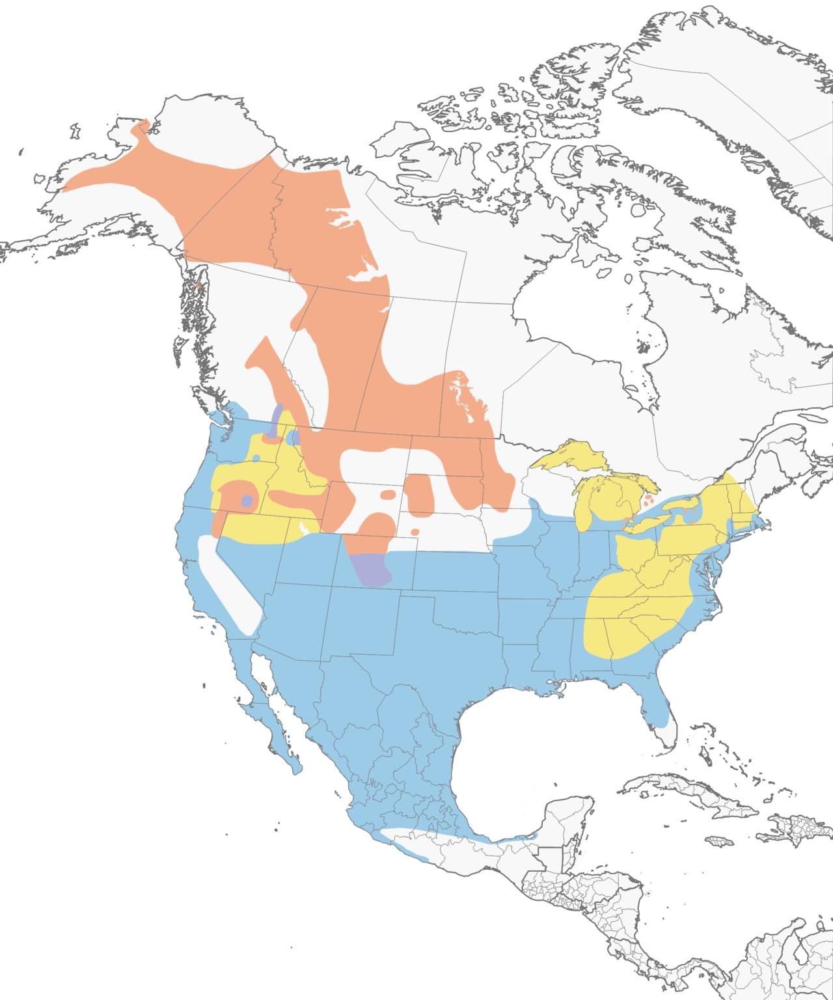

# Canvasback &nbsp; CANV
**Anseriformes** 
**Anatidae** 
 *Aythya valisineria*

## Basic Description
- Wary and swift in flight, often flying high in v-formation
- Larger than related species of diving ducks
- Most easily recognized by the long *ski-jump profile* of the head and bill
- Male has *chestnut* head, black bill, black chest, *whitish back*
- Female has pale tan head and neck contrasting with dark bill and grayish body

## Images

<!---Enter name of .jpg file--->
 

<!---Enter caption--->
Male   

<!---Enter name of .jpg file--->
 

<!---Enter caption--->
Female   

<!---Enter name of range map--->
