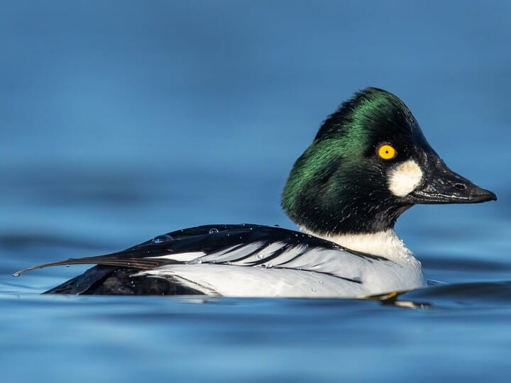
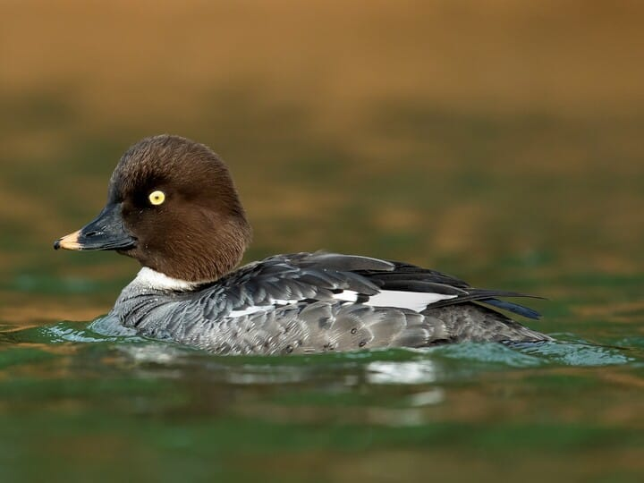
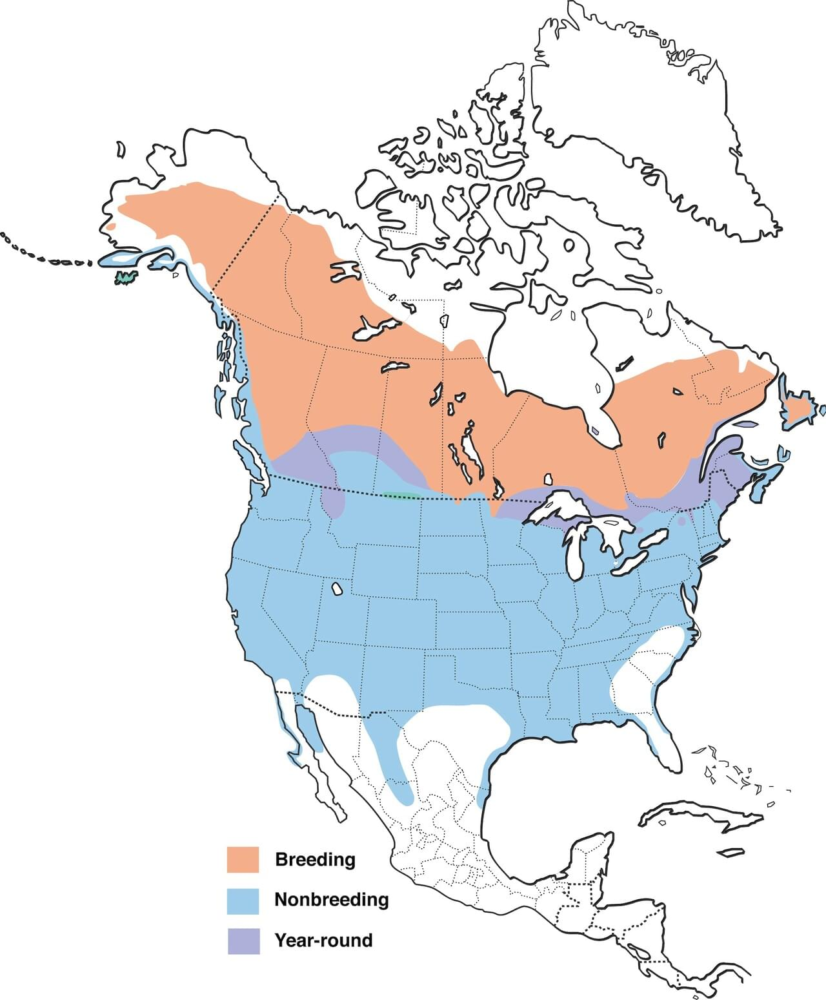

# Common Goldeneye &nbsp; COGO
**Anseriformes** 
**Anatidae** 
 *Bucephala clangula*

## Basic Description
- A sharply patterned duck of lakes, rivers, coastal bays
- Wings make whistling sound in flight
- Male has roundish *white spot* before yellow eye, black head and back contrast with white chest and sides
- Female has chocolate brown head contrasting with gray body, often has yellow tip on black bill
- Young male resembles female through middle of first winter

## Images

<!---Enter name of .jpg file--->
 

<!---Enter caption--->
Male   

<!---Enter name of .jpg file--->
 

<!---Enter caption--->
Female   

<!---Enter name of range map--->

