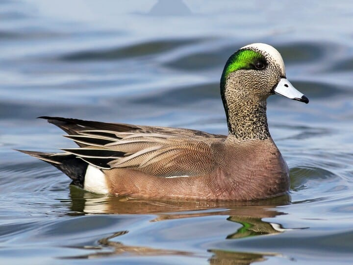
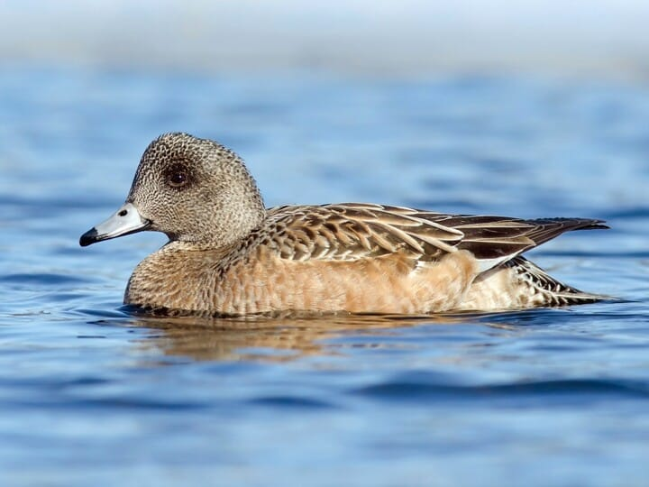
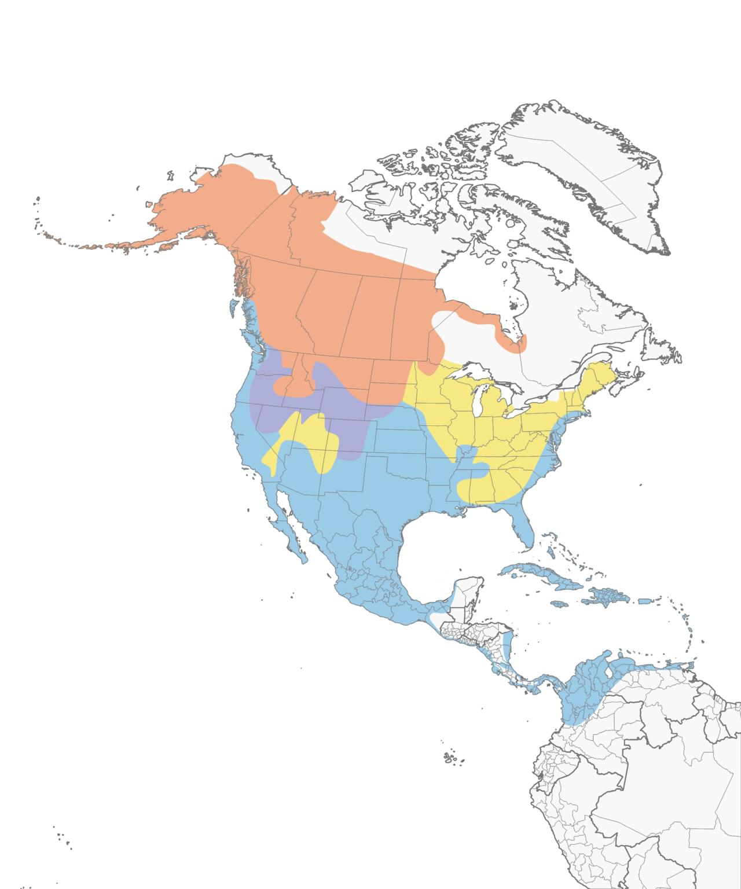

# American Wigeon &nbsp; AMWI
**Anseriformes** 
**Anatidae** 
 *Mareca americana*

## Basic Description
- Also called *Baldpate* for the male's white cap
- Flocks often graze on land near ponds, including golf courses
- On deep water, sometimes steals food from coots or diving ducks
- Male has *white crown stripe*, green ear patch on gray head; pink chest and sides; big white wing patches show in flight
- Female has gray head contrasting with more pinkish body
- Note rather *small blue-gray bill*.

<!--TAG helps me identify what the link points to-->
## Images

 
Male   

 
Female   

