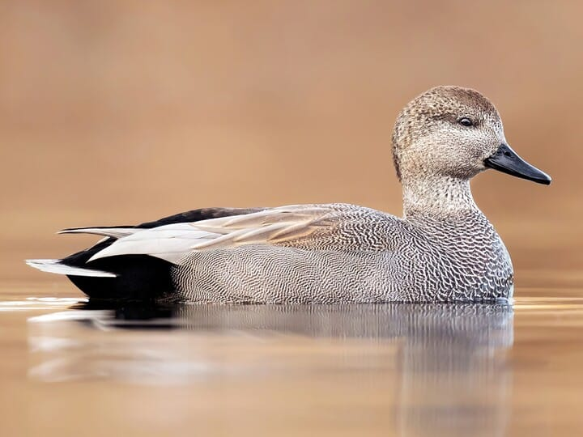
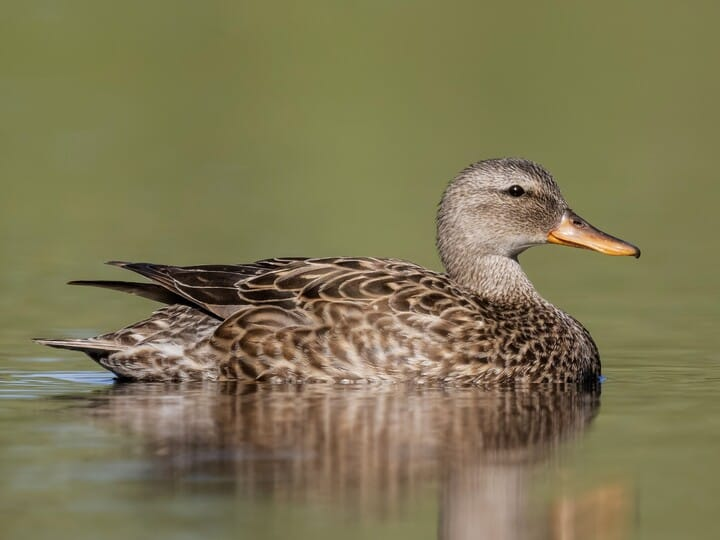
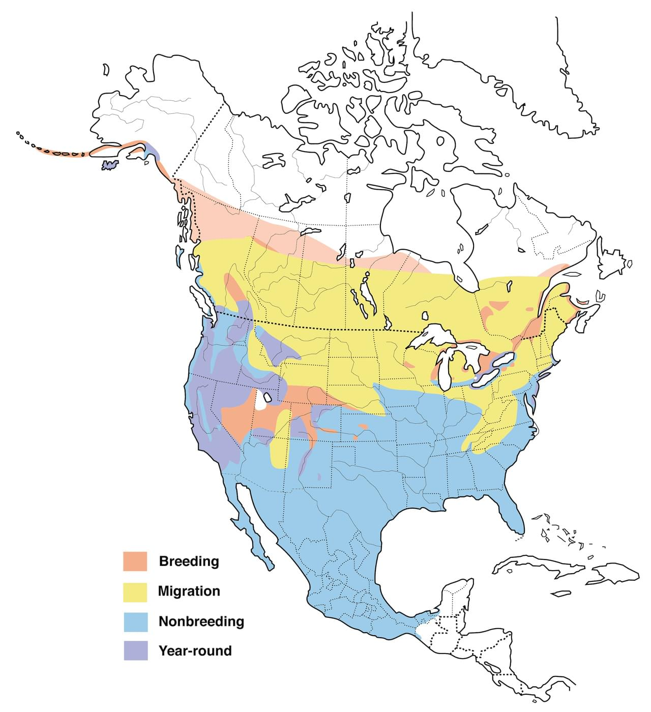

# Gadwall &nbsp; GADW
**Anseriformes** 
**Anatidae** 
 *Mareca strepera*

## Basic Description
- Likes large shallow ponds with lots of marsh plants
- Male mostly gray, with contrasting *black stern*
- Female mottled brown, with gray and orange bill
- Female has a steeper forehead than female Mallard
- Square white patch on trailing edge of wing obvious in flight, sometimes visible while swimming

<!--TAG helps me identify what the link points to-->
## Images

 
Male   

 
Female   

