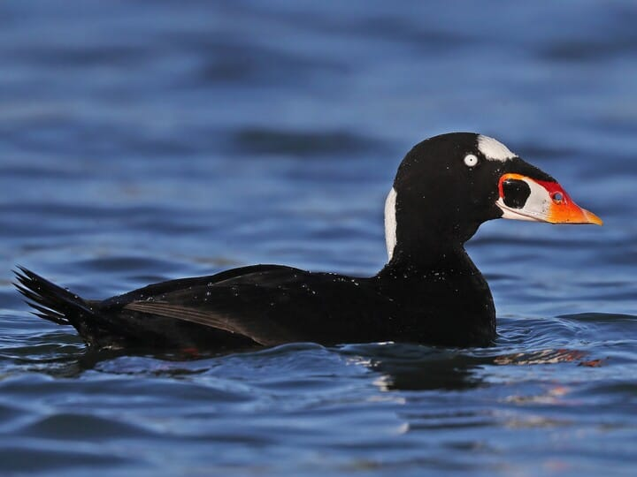
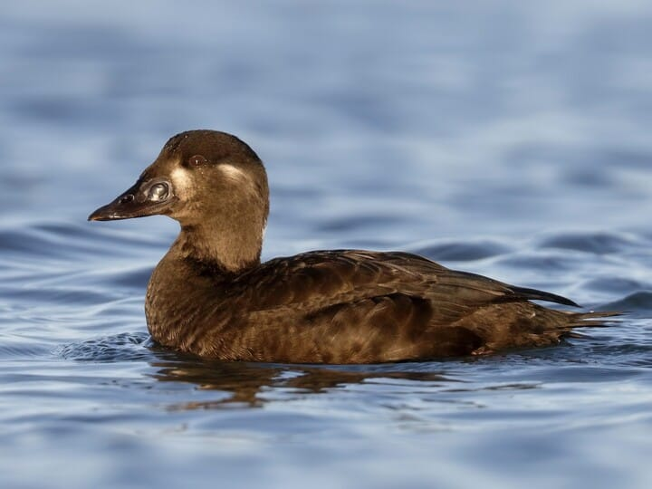
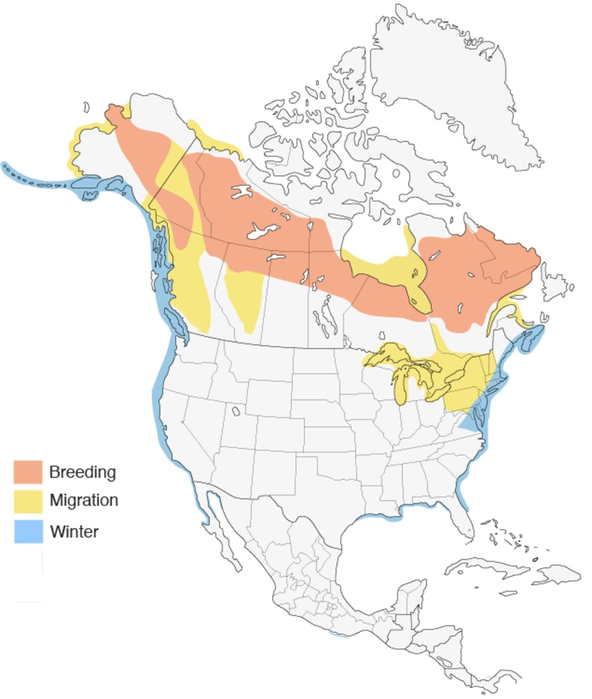

# Surf Scoter &nbsp; SUSC
**Anseriformes** 
**Anatidae** 
 *Melanitta perspicillata*

## Basic Description
- Mostly offshore but small flocks will float sluggishly near piers and jetties
- Male has striking pattern with white head patches, orange and white on bill, otherwise all black
- Female dark sooty brown, with two whitish patces on face
- At close range, note hump on upper mandible

## Images

<!---Enter name of .jpg file--->
 

<!---Enter caption--->
male   

<!---Enter name of .jpg file--->
 

<!---Enter caption--->
female   

<!---Enter name of range map--->
