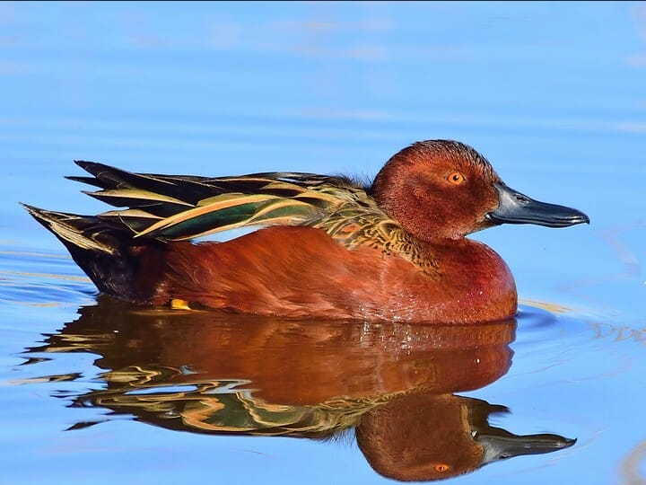
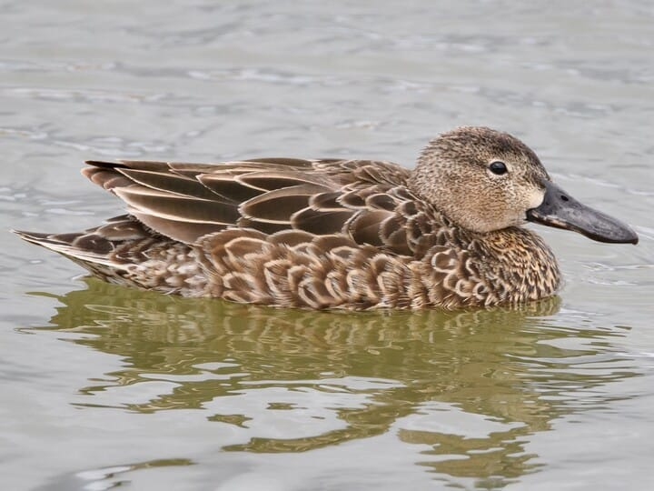
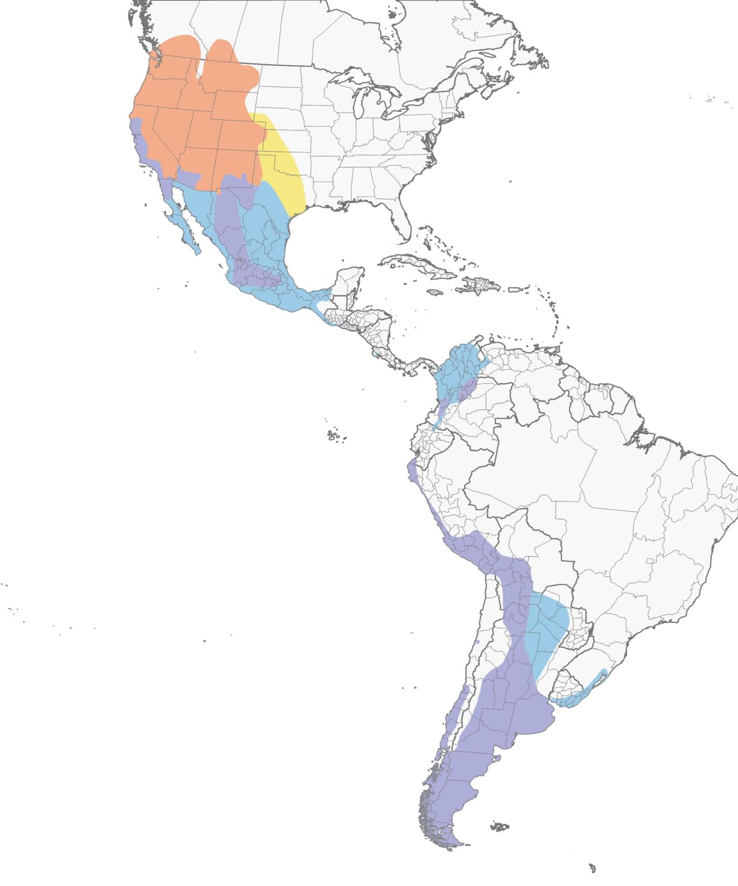

# Cinnamon Teal &nbsp; CITE
**Anseriformes** 
**Anatidae** 
 *Spatula cyanoptera*

## Basic Description
- Bright chestnut male unmistakable in spring
- Female very much like female Blue winged, with same wing pattern, but has slightly heavier and long bill, plainer and browner face
- Many male in fall still wear eclips plumage, looking much like females except for their *red eyes*

## Images

<!---Enter name of .jpg file--->
 
<!---Enter caption--->
Male   

<!---Enter name of .jpg file--->
 
<!---Enter caption--->
Female   

<!---Enter name of range map--->
