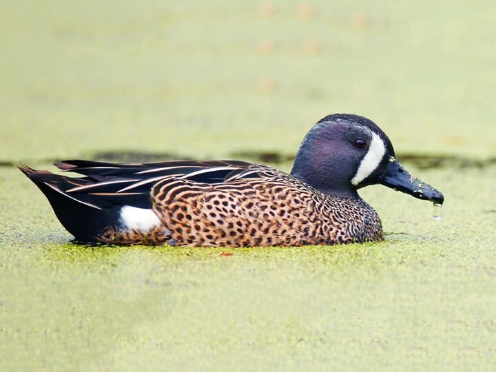
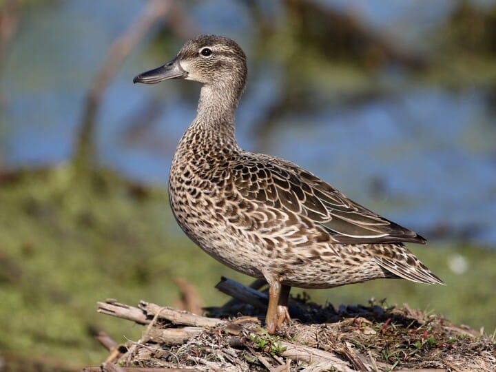
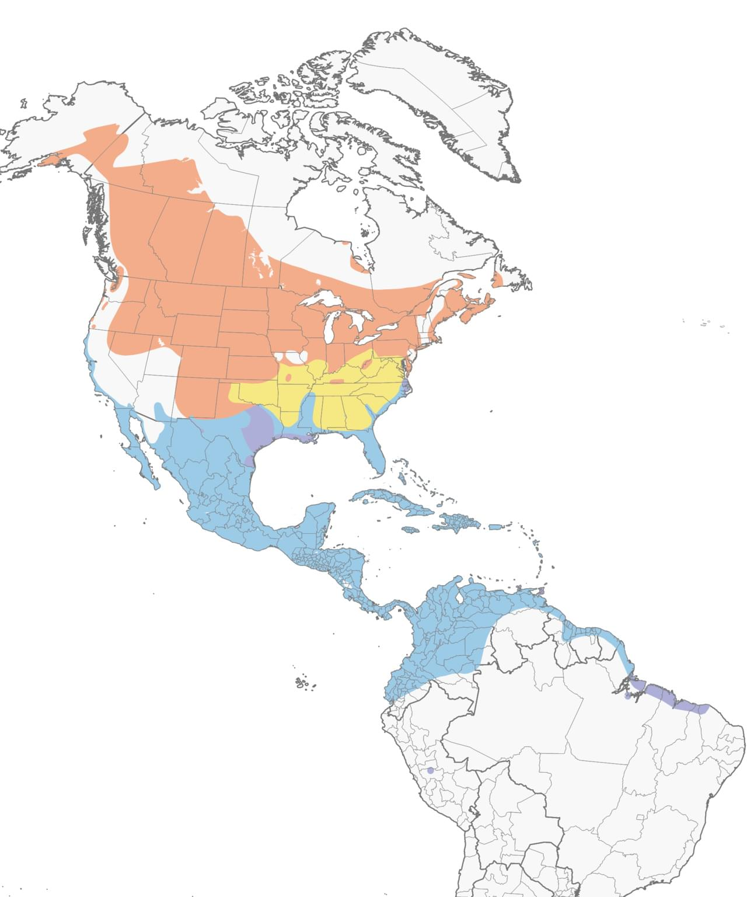

# Blue-winged Teal &nbsp; BWTE
**Anseriformes** 
**Anatidae** 
 *Spatula discors*

## Basic Description
- Pale blue wing patch mostly hidden when swimming, obvious in flight
- Male has *white crescent* on *gray face* in spring
- In fall, many are in eclipse plumage, look like females
- Blue-wing and Cinnamon females very similar

## Images

<!--Enter name of .jpg file>
 

<!--Enter caption>
Male   

<!--Enter name of .jpg file>
 

<!--Enter caption>
Female   

<!--Enter name of range map>
